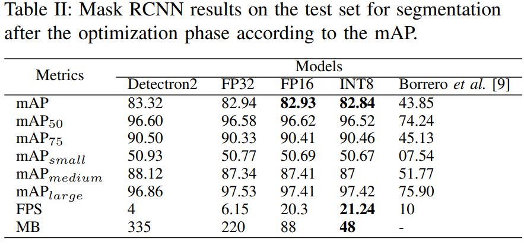
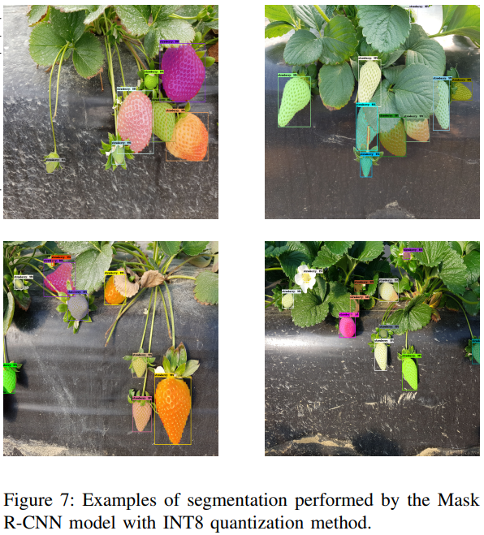

# Strawberry Fruit Image Segmentation

## Description

This repo contains the necessary Google Colab Notebooks to make image segmentation over strawberry fruits using the Detectron2 library to train a Mask R-CNN model and then, with the use of NVIDIA TensorRT, give an optimized model.

## Repository Structure

```
strawberry_image_segmentation
    ├── from_Detectron2_2_TensorRT.ipynb
    ├── LICENSE
    ├── README.md
    ├── train_maskrcnn_strawberry_imageSegmentation.ipynb
    └── transform_labelsMasks_2_cocoFormat_annotations.ipynb
```

### Notebooks:

- [transform_labelsMasks_2_cocoFormat_annotations.ipynb](./transform_labelsMasks_2_cocoFormat_annotations.ipynb) : Notebook to transform original mask labels to Coco Format annotations. The original **[StrawDI_Db1](https://strawdi.github.io/)** dataset is composed by images and labels. The labels are grayscale images that are the same size as the original rgb images and they are stored in PNG format. In the labels images, the value 0 is used for non-strawberry pixels, and strawberry pixels have the index of their strawberry, from 1 to the number of strawberries in the image. So, when you begin the training, the mask image labels demand high RAM and for this reason, the training is only suitable for computers or instances with high resources. Therefore, in order to make more computers available to make the training, we transform the masks images labels to COCO format annotations (labels as `.json` annotations). Also, the labels in Coco format are useful to make model evaluations using the COCO evaluation metrics such as the *mAP* metric.

- [train_maskrcnn_strawberry_imageSegmentation.ipynb](train_maskrcnn_strawberry_imageSegmentation.ipynb) : This Notebook let us to train a Mask R-CNN model using Detectron2 library in order to make image segmentaton over strawberry fruits. Here, we define different functions to make:

    1. Set Up the config to make the training.
    2. Compute evalution metris both in training and validation dataset using Coco Evaluator. The primcipal used metric is mAP.
    3. Train the model.
    4. Evaluate the model over the test dataset and compute mAP.
    5. Make inference over images.
    6. Make inference over a video.

- [from_Detectron2_2_TensorRT.ipynb](from_Detectron2_2_TensorRT.ipynb) : This notebook follows this [guide](https://github.com/NVIDIA/TensorRT/tree/main/samples/python/detectron2) provided by NVIDIA TensorRT official repository. The notebook let us to transfor and optimize the Mask R-CNN model produced in Detectron2 to TensorRT engine. This is useful when we need to optimize the model to deploy it in real life applications using embedded systems. The optimization is make in terms of size of the model and frames per second (FPS) it can process. NVIDIA TensorRT to optimize the model use three quantization methods: **FP32**, **FP16**, and **INT8**. More info at [TensorRT introducing](https://developer.nvidia.com/tensorrt) and [TensorRT official documentation](https://docs.nvidia.com/deeplearning/tensorrt/developer-guide/index.html#quantization). 

## Results:

The results of all the produced model during training and optimization are presented in the following table. Borrero's model is the one used to make comparisson with our models. 



### Inference examples with our optimized model: **INT8**:



More results at our paper: **link to the published paper**

## Dataset, Coco format annotations and Models availability.

### Dataset:

The dataset used is the **[StrawDI_Db1](https://strawdi.github.io/)**. 

### Coco format annotations:

To make training of the Mask RCNN model using detectron2 your will need these [Coco format annotations](https://drive.google.com/drive/folders/1a2WB0PeQHNHdfMxrxPorl5B2GdrKLdK1?usp=share_link). The annotations are obtained after use the [transform_labelsMasks_2_cocoFormat_annotations.ipynb](./transform_labelsMasks_2_cocoFormat_annotations.ipynb) notebook.

### Best Detectron2 Mask R-CNN model: 

[Here](https://drive.google.com/file/d/11HZgGPBEh1qJJ7ksU8jKm7kzXWB8yuMq/view) you can find our best Mask-RCNN model training using Detectron2 library.

### Optimized TensorRT models:

If you want to see our optimizel models, please follow these links: 
- [FP32](https://drive.google.com/file/d/1vAsrp0yUFxw2Nk8a06gMtpLIUXtW8M5v/view?usp=share_link)
- [FP16](https://drive.google.com/file/d/1NRvE1Ev6KlNrXctiDbWOEmnVV7oKYdXc/view?usp=share_link)
- [INT8](https://drive.google.com/file/d/1rHJcGca6JH3uLk4bEP133C7gUG2zwRCS/view?usp=share_link)

To optimize the model using INT8 quantization method may you need a [calibration file](https://drive.google.com/file/d/1pPy_cu8NT9u520v8gmzD8VY74TZB8NBB/view?usp=share_link) in order to avoid expent time.

## License

Our work is released under the [MIT License](./LICENSE).

## Citing our work

If you use our code of this repository in your research or wish to use the models published here, please use the following BibTeX entry.

```
@xxxx{xxxxxxxxxx,
  author =       {xxxxxxxxxx},
  title =        {xxxxxxxxxxx},
  howpublished = {\url{https://github.com/facebookresearch/detectron2}},
  year =         {2023}
}

```